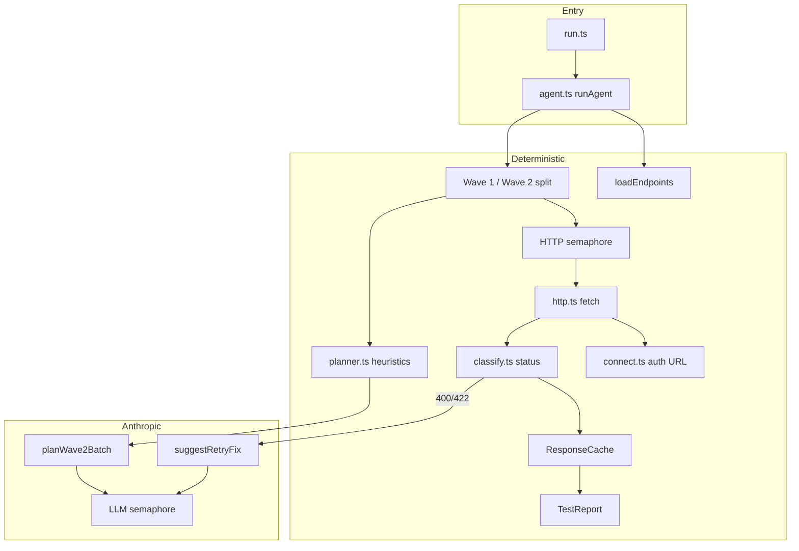

# Complete system architecture (`src_test/`)

## High-level flow

## Phases (all 16 endpoints)

| Phase | What | Concurrency | LLM? |
|-------|------|-------------|------|
| 1 — Wave 1 | Simple GETs, no required body/path | `HTTP_CONCURRENCY` (default 4) | No |
| 2 — Plan | Heuristics for IDs; batch plan for bodies/missing paths | 1 batch call (`LLM_CONCURRENCY` slot) | Yes, once |
| 3 — Wave 2 | Dependent calls with payloads | `HTTP_CONCURRENCY` | No |
| 4 — Retry | Per endpoint on 400/422 only | `LLM_CONCURRENCY` (default 2) | Yes, rare |

Wave 1 **must** finish before phase 2 (cache). Phase 3 uses pre-built plans (no per-endpoint planning).

## Semaphore (shared API keys)

One `GOOGLE_ACCESS_TOKEN` and one `LLM_API_KEY` — not multiple keys sharded.

- **`HTTP_CONCURRENCY`** — max simultaneous `fetch` calls to Google APIs.
- **`LLM_CONCURRENCY`** — max simultaneous Anthropic requests (batch plan + retry fixes).

Without semaphores, `Promise.all` on 10+ endpoints can trigger rate limits or flaky 429s.

## Module responsibilities

| File | Role |
|------|------|
| `agent.ts` | Orchestration, semaphore-limited waves |
| `semaphore.ts` | `Semaphore`, `mapWithConcurrency` |
| `planner.ts` | Wave 2 plans (heuristics → batch LLM) |
| `test-one.ts` | One endpoint: call → classify → retry loop |
| `http.ts` | Build request + `fetch` |
| `llm.ts` | Anthropic JSON (LLM semaphore wrapped) |
| `classify.ts` | HTTP → status enum |
| `cache.ts` | Cross-endpoint response store + path heuristics |
| `utils.ts` | Wave rules, defaults, report sanitization |
| `validate.ts` | Report schema checks |
| `run.ts` | CLI entry → `report-test.json` |

## Friend vs your code

| | `src/` | `src_test/` |
|---|--------|-------------|
| Who | Friends | You |
| Run | `bun run run` | `bun run run:test` |
| Agent | Stub | Full implementation |

Credentials: `GOOGLE_ACCESS_TOKEN`, `LLM_API_URL`, `LLM_API_KEY`, `LLM_MODEL`, optional `HTTP_CONCURRENCY` / `LLM_CONCURRENCY`.
